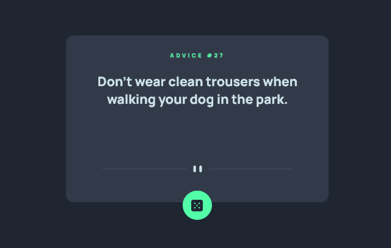
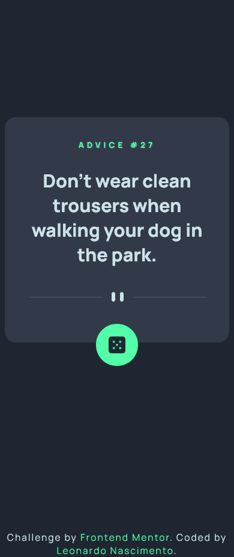

# Frontend Mentor - Advice generator app solution

This is a solution to the [Advice generator app challenge on Frontend Mentor](https://www.frontendmentor.io/challenges/advice-generator-app-QdUG-13db). Frontend Mentor challenges help you improve your coding skills by building realistic projects.

## Table of contents

- [Overview](#overview)
  - [The challenge](#the-challenge)
  - [Screenshot](#screenshot)
  - [Links](#links)
- [My process](#my-process)
  - [Built with](#built-with)
  - [What I learned](#what-i-learned)
  - [Continued development](#continued-development)
  - [Useful resources](#useful-resources)
- [Author](#author)

## Overview

### The challenge

Users should be able to:

- View the optimal layout for the app depending on their device's screen size
- See hover states for all interactive elements on the page
- Generate a new piece of advice by clicking the dice icon

### Screenshot
#### Desktop Version

#### Mobile Version

### Links

- Solution URL: [Code on Github](https://github.com/henrikkudesu/frontendmentor-challenges/tree/main/advice-generator-app)
- Live Site URL: [Github Pages Live URL](https://henrikkudesu.github.io/frontendmentor-challenges/advice-generator-app/)

## My process
As it's a small project, I didn't find it a problem to start with the desktop version. I styled everything as the challenge asks and then the easy part was making the API. There's not much to say about the process.

### Built with
- Semantic HTML5 markup
- CSS custom properties
- Flexbox

### ~~What I learned~~ What i need to learn
Mobile first, urgent. I also need to have a better sense of how to adjust the size of elements. I have the impression that I use percentage very wrongly to adjust the size of divs.

### Continued development
There's no mutch to change in this project, since its working perfectly without any bugs or errors.

### Useful resources
- [ChatGPT](https://chat.openai.com) - It helps me a lot. I don't need to waste time searching on Google or making a post on StackOverflow for possible solution for my problems. It is a great ally for studying.
- [W3Schools](https://www.w3schools.com) - W3Schools is a website optimized for learning, testing, and training. Examples might be simplified to improve reading and basic understanding.

## Author

- Website - [henrikku blog](https://henrikkudesu.github.io/)
- Frontend Mentor - [@henrikkudesu](https://www.frontendmentor.io/profile/henrikkudesu)
- Twitter - [@henrikkudesu](https://twitter.com/henrikkudesu)
- LinkedIn - [Leonardo Nascimento](https://www.linkedin.com/in/leonardo-henrikku/)

