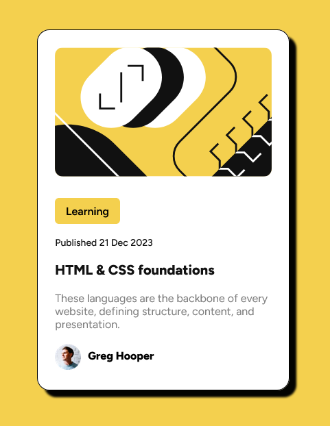

# Frontend Mentor - Blog preview card solution

This is a solution to the [Blog preview card challenge on Frontend Mentor](https://www.frontendmentor.io/challenges/blog-preview-card-ckPaj01IcS). Frontend Mentor challenges help you improve your coding skills by building realistic projects. 

## Table of contents

- [Overview](#overview)
  - [The challenge](#the-challenge)
  - [Screenshot](#screenshot)
  - [Links](#links)
  - [Built with](#built-with)
- [Author](#author)

**Note: Delete this note and update the table of contents based on what sections you keep.**

## Overview

### The challenge

Users should be able to:

- See hover and focus states for all interactive elements on the page

### Screenshot

### Links

- Solution URL:  [Code on GitHub](https://github.com/henrikkudesu/frontendmentor-challenges/tree/main/blog-preview-component)
- Live Site URL: [GitHub Pages Live URL](https://henrikkudesu.github.io/frontendmentor-challenges/blog-preview-component/)

## My process

### Built with

- Semantic HTML5 markup
- CSS custom properties
- CSS Flexbox

## Author

- Website - [henrikku blog](https://henrikkudesu.github.io)
- Frontend Mentor - [@henrikkudesu](https://www.frontendmentor.io/profile/henrikkudesu)
- Twitter - [@henrikkudesu](https://twitter.com/henrikkudesu)
- Linkedin - [Leonardo Nascimento](https://www.linkedin.com/in/leonardo-henrikku/)