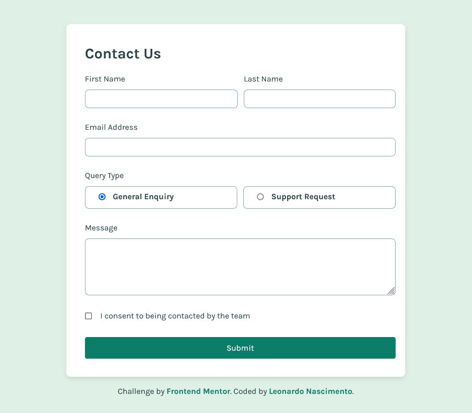

# Frontend Mentor - Contact form solution

This is a solution to the [Contact form challenge on Frontend Mentor](https://www.frontendmentor.io/challenges/contact-form--G-hYlqKJj). Frontend Mentor challenges help you improve your coding skills by building realistic projects. 

## Table of contents

- [Overview](#overview)
  - [The challenge](#the-challenge)
  - [Screenshot](#screenshot)
  - [Links](#links)
- [My process](#my-process)
  - [Built with](#built-with)
  - [What I learned](#what-i-learned)
  - [Continued development](#continued-development)
  - [Useful resources](#useful-resources)
- [Author](#author)
- [Acknowledgments](#acknowledgments)

**Note: Delete this note and update the table of contents based on what sections you keep.**

## Overview

### The challenge

Users should be able to:

- Complete the form and see a success toast message upon successful submission
- Receive form validation messages if:
  - A required field has been missed
  - The email address is not formatted correctly
- Complete the form only using their keyboard
- Have inputs, error messages, and the success message announced on their screen reader
- View the optimal layout for the interface depending on their device's screen size
- See hover and focus states for all interactive elements on the page

### Screenshot

### Links

- Solution URL: [Code on GitHub](https://github.com/henrikkudesu/frontendmentor-challenges/tree/main/contact-form-main)
- Live Site URL: [GitHub Pages Live URL](https://henrikkudesu.github.io/frontendmentor-challenges/contact-form-main)

## My process

### Built with

- Semantic HTML5 markup
- CSS custom properties
- Flexbox

## Author

- Website - [henrikku blog](https://henrikkudesu.github.io)
- Frontend Mentor - [@henrikkudesu](https://www.frontendmentor.io/profile/henrikkudesu)
- Twitter - [@henrikkudesu](https://twitter.com/henrikkudesu)
- Linkedin - [Leonardo Nascimento](https://www.linkedin.com/in/leonardo-henrikku/)