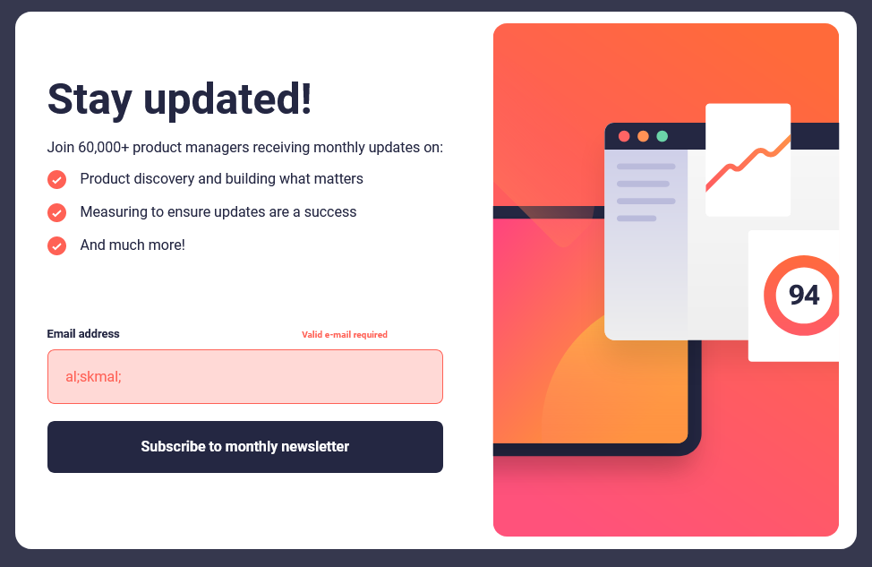
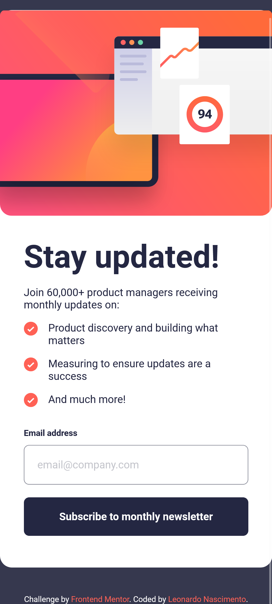

# Frontend Mentor - Stats preview card component solution

This is a solution to the [Newsletter sign-up form with success message](https://www.frontendmentor.io/challenges/newsletter-signup-form-with-success-message-3FC1AZbNrv). Frontend Mentor challenges help you improve your coding skills by building realistic projects. 

## Table of contents

- [Overview](#overview)
  - [The challenge](#the-challenge)
  - [Screenshot](#screenshot)
  - [Links](#links)
- [My process](#my-process)
  - [Built with](#built-with)
  - [Useful resources](#useful-resources)
- [Author](#author)

## Overview

### The challenge

Users should be able to:

- View the optimal layout depending on their device's screen size

### Screenshot

#### Desktop Version

### Desktop Version form__success.html

### Desktop Version error state

#### Mobile Version

### Links

- Solution URL: [Code on Github](https://github.com/henrikkudesu/frontendmentor-challenges/tree/main/newsletter-sign-up-form-with-success-message)
- Live Site URL: [Github Pages Live URL](https://henrikkudesu.github.io/frontendmentor-challenges/newsletter-sign-up-form-with-success-message/)

## My process
Since I haven't coding in html and css for a long time, consider that the code is messed up, maybe some classes out of order in the css and a very poor structure. The project was just for training and remembering concepts. 🤷‍♂️

### Built with

- Semantic HTML5 markup
- CSS custom properties
- Flexbox
- Javascript

### Useful resources

- [ChatGPT](https://chat.openai.com) - It helped me a lot. I don't need to waste time searching on Google or making a post on StackOverflow for possible solution for my problems. It is a great ally for studying.
- [W3Schools](https://www.w3schools.com) - W3Schools is a website optimized for learning, testing, and training. Examples might be simplified to improve reading and basic understanding.

## Author

- Website - [henrikku blog](https://henrikkudesu.github.io/)
- Frontend Mentor - [@henrikkudesu](https://www.frontendmentor.io/profile/henrikkudesu)
- Twitter - [@henrikkudesu](https://twitter.com/henrikkudesu)
- LinkedIn - [Leonardo Nascimento](https://www.linkedin.com/in/leonardo-henrikku/)

