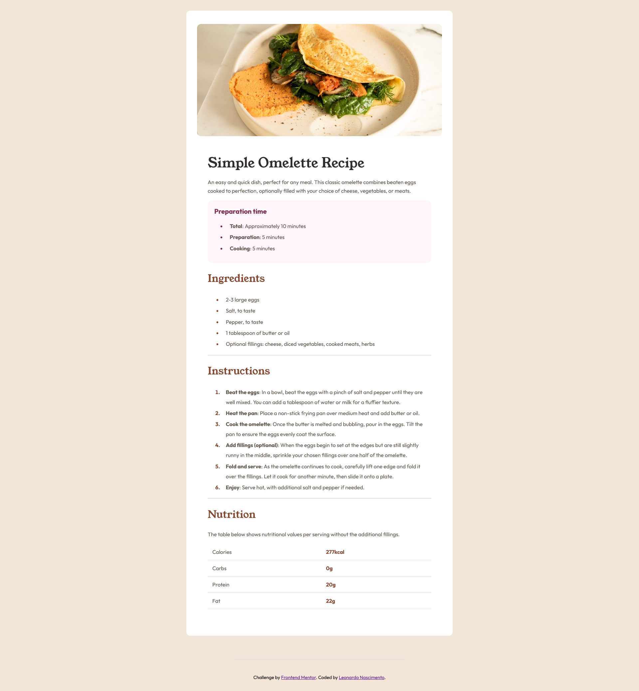
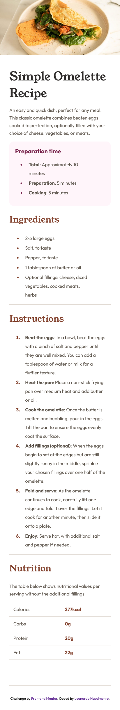

# Frontend Mentor - Recipe page solution

This is a solution to the [Recipe page challenge on Frontend Mentor](https://www.frontendmentor.io/challenges/recipe-page-KiTsR8QQKm). Frontend Mentor challenges help you improve your coding skills by building realistic projects.

## Table of contents

- [Overview](#overview)
  - [The challenge](#the-challenge)
  - [Screenshot](#screenshot)
  - [Links](#links)
- [Author](#author)

## Overview

### Screenshot

#### Desktop Version

#### Mobile Version

### Links

- Solution URL: [GitHub Repository](https://github.com/henrikkudesu/frontendmentor-challenges/tree/main/recipe-page-main)
- Live Site URL: [Live URL](https://henrikkudesu.github.io/frontendmentor-challenges/recipe-page-main)

## Author

- LinkedIn - [Your Name](https://www.linkedin.com/in/leonardo-henrikku/)
- GitHub - [Your GitHub](https://github.com/henrikkudesu)
