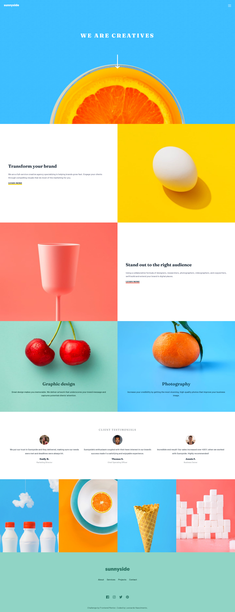

# Frontend Mentor - Sunnyside agency landing page solution

This is a solution to the [Sunnyside agency landing page challenge on Frontend Mentor](https://www.frontendmentor.io/challenges/sunnyside-agency-landing-page-7yVs3B6ef). Frontend Mentor challenges help you improve your coding skills by building realistic projects.

## Table of contents

- [Overview](#overview)
  - [The challenge](#the-challenge)
  - [Screenshots](#screenshots)
  - [Links](#links)
- [Author](#author)

## Overview

### The challenge

Users should be able to:

- View the optimal layout for the site depending on their device's screen size
- See hover states for all interactive elements on the page

### Screenshots

#### Mobile Version

#### Desktop Version

### Links

- Solution URL: [GitHub Repository](https://github.com/henrikkudesu/frontendmentor-challenges/sunnyside-agency-landing-page-main)
- Live Site URL: [Live URL](https://henrikkudesu.github.io/frontendmentor-challenges/sunnyside-agency-landing-page-main)

## Author

- LinkedIn - [Leonardo Henrikku](https://www.linkedin.com/in/leonardo-henrikku/)
- GitHub - [henrikkudesu](https://github.com/henrikkudesu)
